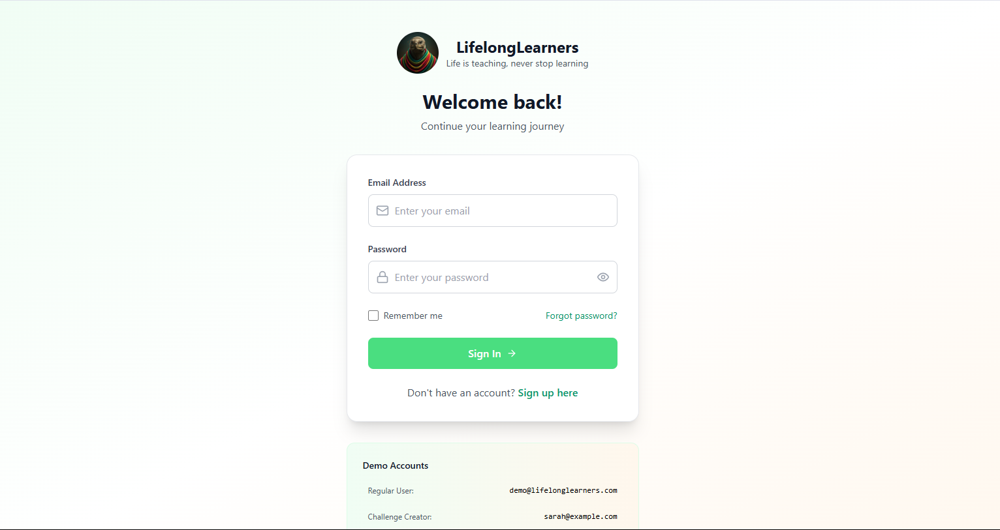
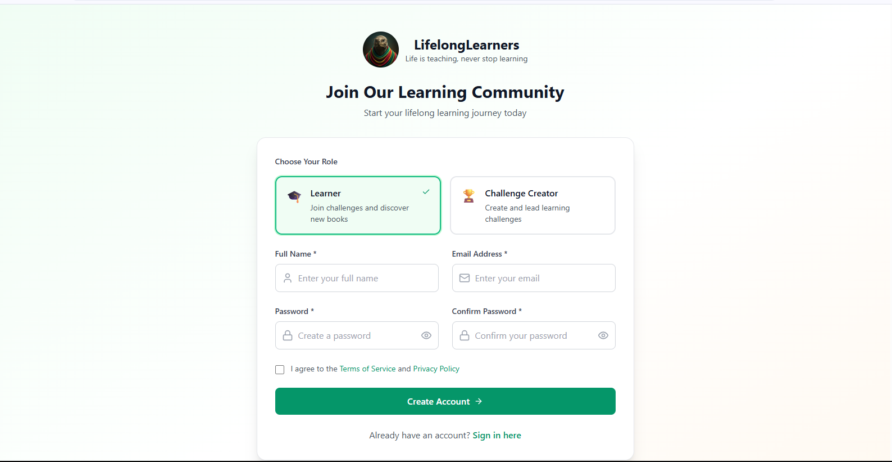
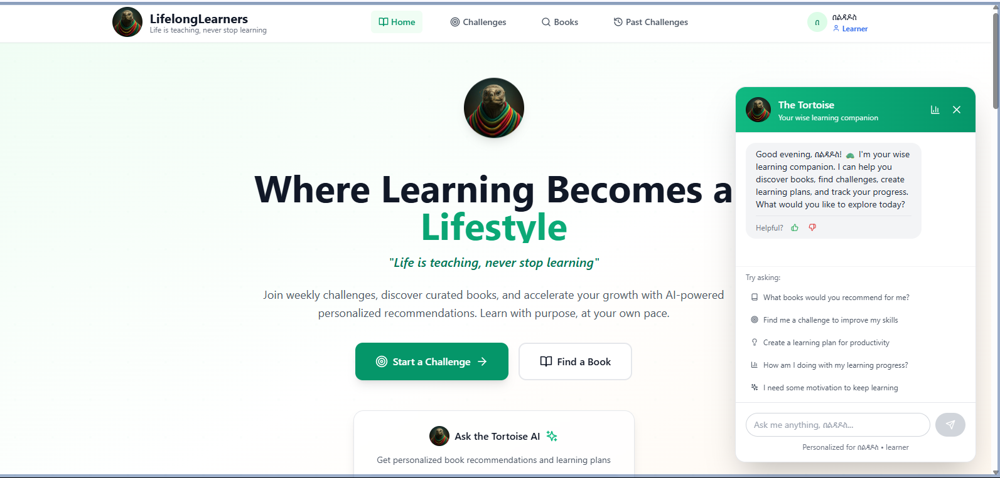

# LifelongLearners Platform

Welcome to LifelongLearners, a community-driven educational platform designed to foster continuous learning and growth. Our platform is built on the principles of collaboration, inclusivity, and accessibility, providing a unique learning experience for individuals from diverse backgrounds and interests.

## Overview

LifelongLearners is more than just an educational platform - it's a community that empowers individuals to take ownership of their learning journey. Our platform offers a wide range of features, including:

* **Curated Learning Paths**: Explore a vast library of curated learning paths tailored to your interests and goals.
* **Community Engagement**: Engage with like-minded individuals through discussion forums, live sessions, and collaborative projects.
* **AI-Powered Recommendations**: Receive personalized learning recommendations based on your interests, preferences, and learning style.
* **Real-Time Feedback**: Get instant feedback on your progress, helping you adjust your learning strategy for optimal results.

## Screenshots

Here are some screenshots of our platform in action:

## Videos

Watch our introductory videos to learn more about LifelongLearners and how it can benefit you:

### Introduction to LifelongLearners

### Exploring LifelongLearners Features

## Join the Community

Ready to embark on your lifelong learning journey? Sign up now and become a part of our vibrant community!

[Sign Up](#2)

## Contributing

LifelongLearners is an open-source project, and we welcome contributions from the community. If you're interested in contributing to our platform, please refer to our [Contributing Guidelines](CONTRIBUTING.md).

## License

LifelongLearners is licensed under the [MIT License](LICENSE.md).

## Contact Us

Have questions or feedback? Reach out to us at [info@lifelonglearners.com](mailto:info@lifelonglearners.com).
